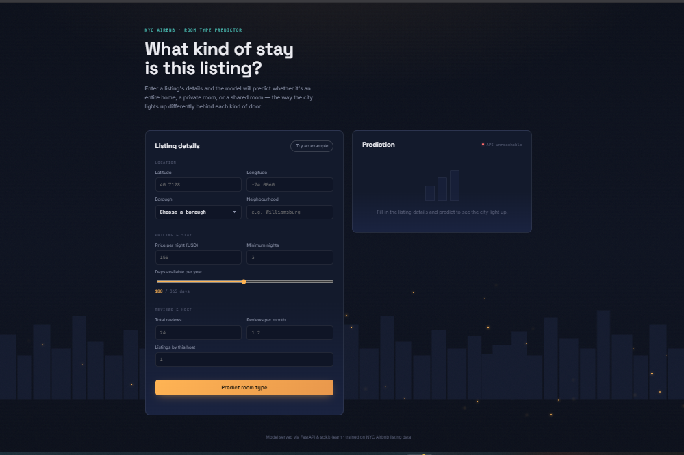

# 🏙️ New York City Airbnb ML & Analytics Web App

An end-to-end Machine Learning web application designed to evaluate and predict New York City Airbnb listing attributes. The repository combines exploratory data analysis, a robust Scikit-Learn preprocessing pipeline (`RandomizedSearchCV`), and a custom Web Frontend interface deployed on **Render**.

[](YOUR_RENDER_LIVE_APP_LINK_HERE)

---

## 🖼️ Application Preview


---

## 🖼️ Application Preview & UI



> _Interactive Streamlit dashboard designed with business-friendly feature inputs, fault-tolerant logic, and instant fraud probability metrics._

---

## 🔗 Live Application

The application is hosted live on **Render**. You can test it directly here:  
👉 **[Click Here to Launch Render Live Demo](YOUR_RENDER_LIVE_APP_LINK_HERE)**

---

## 📊 Model Benchmarks & Metrics

Multiple baseline models were trained and tuned using hyperparameter optimization. **Random Forest** yielded the highest performance metrics across the board:

| Model Algorithm                  |  Accuracy Score   | F1-Score  |       Status       |
| :------------------------------- | :---------------: | :-------: | :----------------: |
| **Random Forest Classifier** 🏆  | **0.851 (85.1%)** | **0.713** | **Selected Model** |
| **Gradient Boosting Classifier** |   0.850 (85.0%)   |   0.706   |   High Precision   |
| **Decision Tree Classifier**     |   0.786 (78.6%)   |   0.655   |      Baseline      |
| **Logistic Regression**          |   0.726 (72.6%)   |   0.575   |      Baseline      |

---

## ⚙️ Model Pipeline & Architecture

The machine learning core uses a unified `ColumnTransformer` integrated into a Scikit-Learn `Pipeline` tuned with `RandomizedSearchCV`:

- **Numerical Preprocessing:** `SimpleImputer` ➔ `PowerTransformer` ➔ `StandardScaler`
- **Categorical Preprocessing:** `SimpleImputer` ➔ `OneHotEncoder`
- **Final Estimator:** `RandomForestClassifier`

---

## 📁 Repository Structure

```text
├── AB_NYC_2019.csv            # NYC Airbnb Dataset
├── .gitignore                 # Git Ignore File
├── .gitattributes             # Git Attributes File
├── requirements.txt           # Python Dependencies
├── notebook.ipynb             # Analysis, Pipeline Design & Model Training
├── main.py                    # Backend Server Script (API/Inference)
├── Model_Pipeline.pkl         # Serialized Scikit-Learn Pipeline
├── index.html                 # Frontend Web Interface UI
├── style.css                  # Custom Application Stylesheet
├── script.js                  # Frontend Interactivity & API Fetching
├── the_build_line_guide.html  # Pipeline & Application Guide Documentation
└── New_York_City_.png         # Application Banner / Asset
```

```bash
git clone https://github.com/amirsohail100/New-York-City-Airbnb-ML-Analytics-Web-App.git
```

```bash
cd New-York-City-Airbnb-ML-Analytics-Web-App
```

```bash
streamlit run app.py
```

```bash
pip install -r requirements.txt
```

## 📄 License

This project is licensed under the MIT License.

## 📝 Author

👤 **Amir Sohail**

NYC Airbnb Machine Learning pipeline evaluating listings using Random Forest (85.1% accuracy) with ColumnTransformer preprocessing. Features a web UI (HTML/CSS/JS + FastAPI/Flask main server) &amp; serialized pipeline inference.
